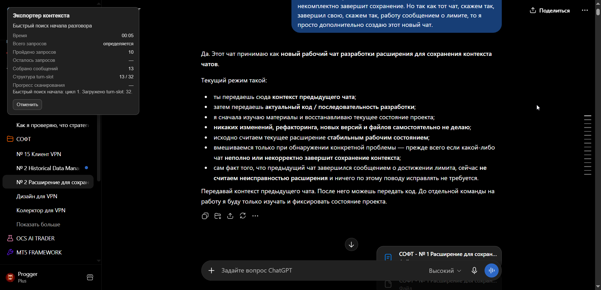
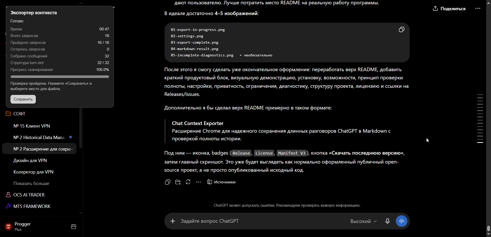
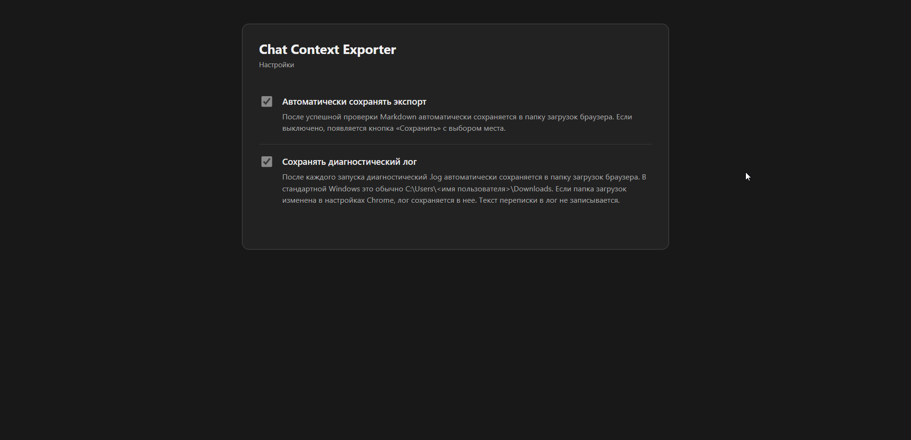
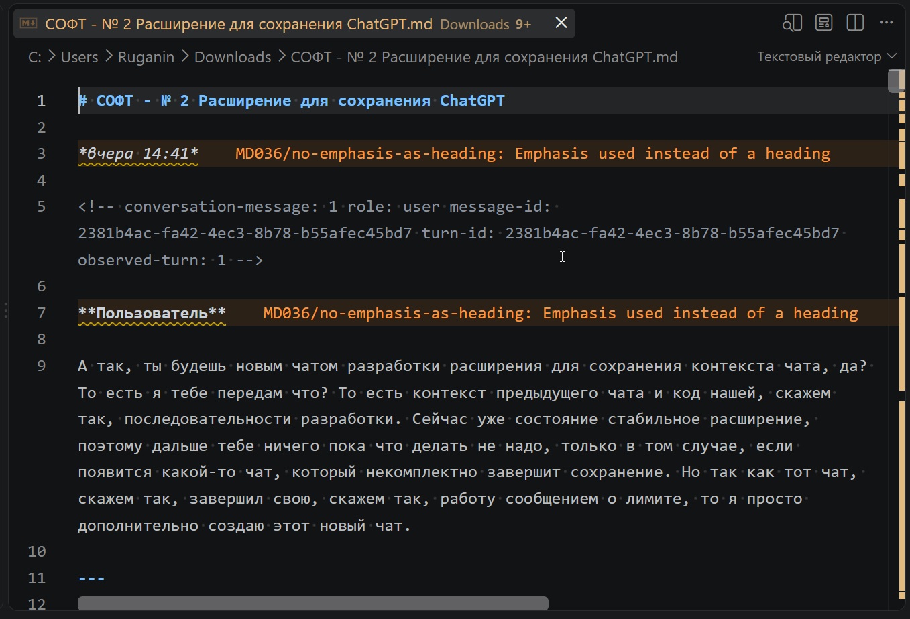
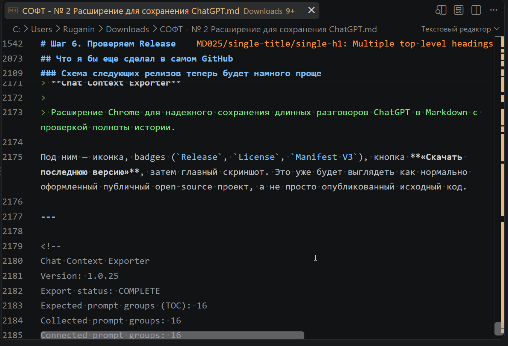

# Chat Context Exporter

<p align="center">
  
</p>

<p align="center">
  <strong>Расширение Google Chrome для надежного сохранения длинных разговоров ChatGPT в Markdown с проверкой полноты истории.</strong>
</p>

<p align="center">
  <a href="https://github.com/Skhematoznik/Chat-Context-Exporter/releases/latest"></a>
  <a href="LICENSE"></a>
  
  
</p>

<p align="center">
  <a href="https://github.com/Skhematoznik/Chat-Context-Exporter/releases/latest"><strong>Скачать последнюю версию</strong></a>
  ·
  <a href="https://github.com/Skhematoznik/Chat-Context-Exporter/issues">Сообщить об ошибке</a>
</p>

**Текущая версия: стабильный публичный релиз 1.0.25.**

Chat Context Exporter сохраняет открытый диалог ChatGPT в Markdown (`.md`). Он предназначен прежде всего для длинных рабочих чатов, где обычное копирование страницы или сохранение MHTML может оказаться неполным из-за виртуализации интерфейса ChatGPT: в DOM одновременно находится только часть истории.

Расширение самостоятельно проходит чат, накапливает сообщения и перед выдачей статуса `COMPLETE` проверяет, удалось ли связать историю целиком.

> Проект не связан с OpenAI и не является официальным расширением ChatGPT.

## Как выглядит экспорт

<p align="center">
  
</p>

Во время работы расширение показывает текущую фазу, время, количество найденных prompt-групп, собранных сообщений, turn-slot и прогресс сканирования.

## Возможности

- экспорт открытого чата ChatGPT в Markdown одним запуском;
- работа с длинными виртуализированными диалогами;
- поиск настоящего начала разговора независимо от исходной позиции прокрутки;
- последовательное накопление сообщений вместо чтения только текущего DOM;
- сохранение ролей `Пользователь` / `ChatGPT`;
- сохранение Markdown-разметки, таблиц и блоков кода;
- сохранение имен пользовательских вложений, когда они доступны в интерфейсе;
- сохранение сгенерированных ChatGPT артефактов, когда они доступны в DOM;
- сохранение промежуточных сообщений и доступных processing details;
- учет служебных turn-slot, не являющихся обычными сообщениями;
- checkpoint в `chrome.storage.local` для длительных проходов;
- пауза при скрытии вкладки и продолжение после возврата;
- автоматическое сохранение результата или ручной выбор места;
- диагностический лог;
- явное различие между подтвержденным полным и неполным экспортом.

## Проверка полноты

Расширение **не считает файл полным только потому, что дошло до нижней части страницы**.

Перед статусом `COMPLETE` сопоставляются доступные структурные признаки ChatGPT:

- canonical `message-id`;
- последовательность turn-slot;
- prompt-группы из TOC, если ChatGPT их предоставляет;
- связность цепочки сообщений от начала до конца;
- стабильность повторных наблюдений;
- служебные `PROCESSING_ONLY`, `AUXILIARY_ASSISTANT` и `EMPTY_OR_ABORTED` turn-slot;
- отсутствие неразрешенных разрывов.

Если полнота не доказана, результат сохраняется как неполный с префиксом:

```text
НЕПОЛНЫЙ - <название чата>.md
```

Это намеренно консервативное поведение: расширение не выдает `COMPLETE`, если не может подтвердить целостность экспорта.

## Успешное завершение

<p align="center">
  
</p>

После проверки отображается итоговый статус, количество пройденных prompt-групп, сообщений и turn-slot. При отключенном автоматическом сохранении появляется кнопка **«Сохранить»**.

## Установка

1. Откройте страницу [Releases](https://github.com/Skhematoznik/Chat-Context-Exporter/releases/latest).
2. Скачайте `Chat-Context-Exporter-v1.0.25.zip`.
3. Распакуйте архив в отдельную постоянную папку.
4. Откройте в Google Chrome:

```text
chrome://extensions/
```

5. Включите **Режим разработчика**.
6. Нажмите **Загрузить распакованное расширение**.
7. Выберите папку, в которой находится `manifest.json`.
8. При необходимости закрепите Chat Context Exporter на панели Chrome.

> Не удаляйте и не перемещайте распакованную папку после установки: Chrome загружает расширение непосредственно из нее.

Сборка не требуется: расширение написано на обычных HTML/CSS/JavaScript и использует Manifest V3.

## Использование

1. Откройте нужный чат ChatGPT.
2. Нажмите значок **Chat Context Exporter**.
3. Дождитесь завершения прохода и проверки.
4. Не закрывайте вкладку во время экспорта. Переключаться на другие вкладки можно: экспорт поставится на паузу и продолжится после возврата.
5. После успешной проверки Markdown будет сохранен автоматически либо появится кнопка ручного сохранения — в зависимости от настройки.

Для длинных чатов экспорт может занимать заметное время. Это штатно: приоритет — **полнота результата, а не максимальная скорость прокрутки**.

## Настройки

<p align="center">
  
</p>

### Автоматически сохранять экспорт

После успешной проверки Markdown автоматически сохраняется через стандартный механизм загрузок Chrome.

Если опцию отключить, после проверки появляется кнопка **«Сохранить»** с выбором места.

### Сохранять диагностический лог

После запуска дополнительно сохраняется текстовый диагностический файл с ходом сканирования, счетчиками, состояниями verifier и причинами repair/recovery.

Полный текст переписки в диагностический лог не записывается.

## Что находится в Markdown

<p align="center">
  
</p>

Для обычного сообщения добавляется служебный комментарий вида:

```html
<!-- conversation-message: 42 role: assistant message-id: ... turn-id: ... -->
```

Он используется для проверки порядка и дедупликации. После него идет обычный читаемый Markdown.

Для подтвержденных служебных turn-slot используются отдельные markers, например:

```html
<!-- noncanonical-turn: ... role: assistant type: PROCESSING_ONLY -->
```

В конце файла находится технический footer с версией экспортера, статусом, количеством prompt-групп, сообщений, turn-slot, processing-блоков, артефактов и временем выполнения.

<p align="center">
  
</p>

## Статусы результата

### `COMPLETE`

Расширение смогло доказать полноту цепочки по доступным структурным данным ChatGPT.

### `INCOMPLETE`

Остался хотя бы один существенный разрыв, нестабильное сообщение, неизвестный turn-slot или иная причина, из-за которой полноту нельзя подтвердить.

`INCOMPLETE` не означает автоматически, что весь файл бесполезен. Это означает только то, что расширение **не дает ложной гарантии**, что экспорт содержит весь чат.

## Поддерживаемый браузер

Официально поддерживается и тестируется только **Google Chrome**.

Работа в Microsoft Edge, Brave, Opera и других браузерах на Chromium **не тестировалась и не заявляется как поддерживаемая**.

## Поддерживаемые адреса ChatGPT

Текущая версия рассчитана на:

- `https://chatgpt.com/`
- `https://chat.openai.com/`

Доступ к содержимому текущей вкладки предоставляется расширению после действия пользователя.

## Разрешения Chrome

| Разрешение | Для чего используется |
| --- | --- |
| `activeTab` | доступ к текущей вкладке после действия пользователя |
| `scripting` | запуск экспортера на открытой странице ChatGPT |
| `storage` | настройки, checkpoint и промежуточное состояние |
| `unlimitedStorage` | длинные чаты могут требовать большой локальный checkpoint |
| `downloads` | сохранение Markdown и диагностического лога |
| `contextMenus` | быстрые переключатели настроек в меню расширения |

## Приватность

В версии 1.0.25 нет кода, отправляющего содержимое чатов на внешние серверы.

Обработка выполняется локально в браузере:

- содержимое страницы читается после запуска расширения пользователем;
- промежуточные данные и checkpoint хранятся в `chrome.storage.local`;
- итоговый Markdown сохраняется через Chrome Downloads;
- диагностический лог сохраняется локально;
- расширение не содержит собственной сетевой отправки содержимого чата через `fetch`, `XMLHttpRequest` или WebSocket.

Подробности: [`PRIVACY.md`](PRIVACY.md).

## Ограничения

ChatGPT является динамическим веб-приложением, поэтому его DOM и внутренняя разметка могут измениться без предупреждения.

Также следует учитывать:

- MHTML и содержимое текущего DOM не являются надежным эталоном полноты длинного чата;
- отдельные даты и временные разделители сохраняются только при достаточной уверенности в их привязке;
- если сам ChatGPT после перезагрузки перестал отдавать ранее видимый ответ, расширение не может восстановить его задним числом;
- некоторые служебные элементы намеренно остаются `UNRESOLVED`, если их тип нельзя классифицировать безопасно;
- скорость экспорта зависит от длины чата, виртуализации ChatGPT и производительности вкладки.

## Ошибки и Issues

Сообщения о воспроизводимых ошибках принимаются **только через [GitHub Issues](https://github.com/Skhematoznik/Chat-Context-Exporter/issues)**.

Если экспорт завершился как `INCOMPLETE` или обнаружена фактическая потеря содержимого, желательно приложить:

1. версию расширения;
2. диагностический лог;
3. сохраненный `НЕПОЛНЫЙ - ...md`;
4. при возможности MHTML той же страницы;
5. краткое описание условий воспроизведения.

Не публикуйте приватные чаты и диагностические материалы в открытом Issue, если они содержат конфиденциальные данные.

## Статус проекта

Chat Context Exporter был создан как законченная утилита под конкретную практическую задачу и опубликован для свободного использования.

**Добавление нового функционала не запланировано. Roadmap отсутствует.**

Проект предоставляется по принципу **as is**. Публикация исходного кода и наличие GitHub Issues не являются обещанием дальнейшего развития, регулярных обновлений, технической поддержки или обязательного исправления каждой зарегистрированной проблемы.

Воспроизводимые ошибки могут исправляться по мере необходимости.

## Структура проекта

```text
.
├── .github/
│   └── ISSUE_TEMPLATE/
├── docs/
│   ├── images/
│   ├── GITHUB_RELEASE_1.0.25.md
│   └── RELEASE_1.0.25.md
├── icons/
├── manifest.json
├── background.js
├── exporter.js
├── options.html
├── options.css
├── options.js
├── README.md
├── CHANGELOG.md
├── PRIVACY.md
└── LICENSE
```

## Версия 1.0.25

`1.0.25` исправляет no-TOC сценарий, при котором unresolved служебные turn-slot могли одновременно разрывать canonical chain и блокировать собственный локальный repair.

Критерий `COMPLETE` при этом не ослаблен: после repair verifier по-прежнему должен доказать полную связность и стабильность истории.

Подробности: [`docs/RELEASE_1.0.25.md`](docs/RELEASE_1.0.25.md).

## Разработка

Проект не требует npm, bundler или отдельного build-step.

Минимальная проверка JavaScript:

```bash
node --check background.js
node --check exporter.js
node --check options.js
```

Проверка `manifest.json`:

```bash
python -m json.tool manifest.json
```

## Лицензия

Автор: **Skhematoznik**.

Проект распространяется по лицензии **MIT**. Разрешено свободно использовать, копировать, изменять, публиковать, распространять, включать в другие проекты, сублицензировать и продавать копии программного обеспечения, в том числе в коммерческих целях.

Условие лицензии — сохранение уведомления об авторском праве и текста MIT License в копиях или существенных частях программного обеспечения.

Программное обеспечение предоставляется без гарантий. Полный текст: [`LICENSE`](LICENSE).
